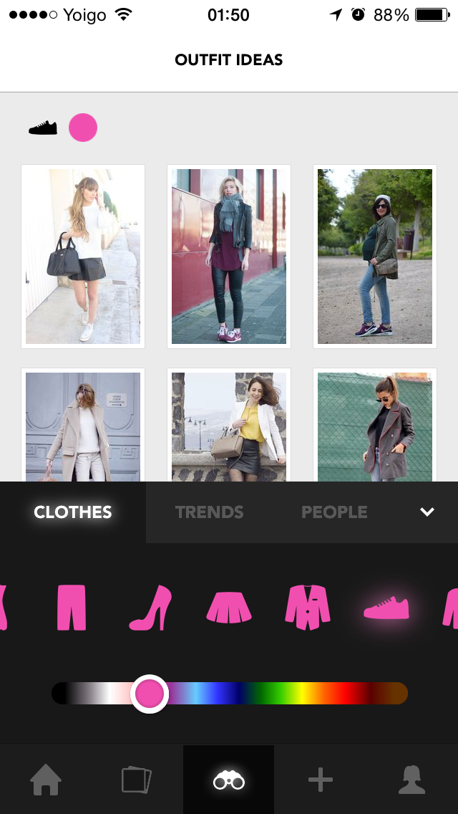

ColorMatcher
======

[](https://travis-ci.org/pedrogimenez/color_matcher)

ColorMatcher it's a gem that given a color, returns the nearest one from a collection.

## Usage

You should read the [tests](https://github.com/pedrogimenez/color_matcher/blob/master/spec/color_matcher_spec.rb) as they are the most updated documentation.

There's only one method:

```ruby
  ColorMatcher.closest_color("000000", ["000000", "ffffff"]) # => 000000
```

## How do we use it at Chicisimo

We use the color matcher at Chicisimo to match our looks with the color picked using the slider in our discover section:

<p align="center">
  
</p>

## Algorithm

We are using the Euclidean distance algorithm as described [here](http://www.compuphase.com/cmetric.htm).

## License

ColorMatcher is open-sourced software licensed under the MIT license.
